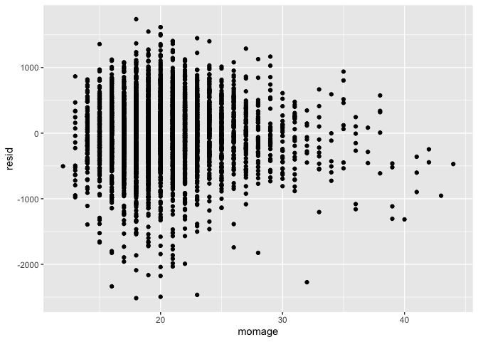

p8105\_hw6\_mk4022
================
Mary Knoop
11/23/2019

**Question 1:**  
*Part A:* Load and clean the data for regression analysis (i.e. convert
numeric to factor where appropriate, check for missing data, etc.).

``` r
bw_data=
  read_csv ("./data/birthweight.csv") %>% 
  janitor::clean_names() %>%
  mutate(babysex = factor(babysex, levels =  c("1", "2"), labels = c("male", "female")),
         frace = factor(frace, levels =  c("1", "2", "3", "4", "8", "9"), labels = c("white", "black", "asian", "puerto rican", "other", "unknown")),
         malform = factor(malform, levels =  c("0", "1"), labels = c("absent", "present")),
         mrace = factor(mrace, levels =  c("1", "2", "3", "4", "8"), labels = c("white", "black", "asian", "puerto rican", "other"))
           )
```

    ## Parsed with column specification:
    ## cols(
    ##   .default = col_double()
    ## )

    ## See spec(...) for full column specifications.

``` r
bw_data
```

    ## # A tibble: 4,342 x 20
    ##    babysex bhead blength   bwt delwt fincome frace gaweeks malform menarche
    ##    <fct>   <dbl>   <dbl> <dbl> <dbl>   <dbl> <fct>   <dbl> <fct>      <dbl>
    ##  1 female     34      51  3629   177      35 white    39.9 absent        13
    ##  2 male       34      48  3062   156      65 black    25.9 absent        14
    ##  3 female     36      50  3345   148      85 white    39.9 absent        12
    ##  4 male       34      52  3062   157      55 white    40   absent        14
    ##  5 female     34      52  3374   156       5 white    41.6 absent        13
    ##  6 male       33      52  3374   129      55 white    40.7 absent        12
    ##  7 female     33      46  2523   126      96 black    40.3 absent        14
    ##  8 female     33      49  2778   140       5 white    37.4 absent        12
    ##  9 male       36      52  3515   146      85 white    40.3 absent        11
    ## 10 male       33      50  3459   169      75 black    40.7 absent        12
    ## # … with 4,332 more rows, and 10 more variables: mheight <dbl>,
    ## #   momage <dbl>, mrace <fct>, parity <dbl>, pnumlbw <dbl>, pnumsga <dbl>,
    ## #   ppbmi <dbl>, ppwt <dbl>, smoken <dbl>, wtgain <dbl>

*Part B:* Propose a regression model for birthweight.  
\* The model I created as ‘fit1’ is based on evidence supporting that
mother’s age, smoking status/quantity, and history of previous low
birthweight births are predictive of giving birth to a child with low
birthweight. I also included sex and presence of malformations that
could impact weight so that we can control for these factors which may
be potential confounders.  
\* I will use the A1C of each model to determine the best model.  
\* The A1C of model ‘fit1’ is 66364.13.  
\* The A1C of model ‘fit2’ is 62770.34.  
\* The A1C of model ‘fit3’ is .  
\* According to the A1C’s of the above three models, the best model for
this dataset is model ‘fitx’.

``` r
##### Model 1 #####
#set references for factor variables
bw_data = 
  bw_data %>% 
  mutate(
    malform = fct_infreq(malform),
    babysex = fct_infreq(babysex)
  )

#create linear model
fit1 = lm(bwt ~ momage + pnumlbw + smoken + babysex + malform, data = bw_data)
fit1
```

    ## 
    ## Call:
    ## lm(formula = bwt ~ momage + pnumlbw + smoken + babysex + malform, 
    ##     data = bw_data)
    ## 
    ## Coefficients:
    ##    (Intercept)          momage         pnumlbw          smoken  
    ##       2808.054          18.401              NA          -6.117  
    ##  babysexfemale  malformpresent  
    ##        -85.974           2.480

``` r
#tidy output
fit1 %>% 
  broom::tidy() %>%
  select(term, estimate, p.value) %>% 
  knitr::kable(digits = 3)
```

| term           | estimate | p.value |
| :------------- | -------: | ------: |
| (Intercept)    | 2808.054 |   0.000 |
| momage         |   18.401 |   0.000 |
| smoken         |  \-6.117 |   0.000 |
| babysexfemale  | \-85.974 |   0.000 |
| malformpresent |    2.480 |   0.985 |

``` r
#view A1C and other output parameters
fit1 %>% 
  broom::glance() 
```

    ## # A tibble: 1 x 11
    ##   r.squared adj.r.squared sigma statistic  p.value    df  logLik    AIC
    ##       <dbl>         <dbl> <dbl>     <dbl>    <dbl> <int>   <dbl>  <dbl>
    ## 1    0.0329        0.0320  504.      36.9 2.37e-30     5 -33176. 66364.
    ## # … with 3 more variables: BIC <dbl>, deviance <dbl>, df.residual <int>

``` r
#add residuals and predictions
modelr::add_residuals(bw_data, fit1)
```

    ## Warning in predict.lm(model, data): prediction from a rank-deficient fit
    ## may be misleading

    ## # A tibble: 4,342 x 21
    ##    babysex bhead blength   bwt delwt fincome frace gaweeks malform menarche
    ##    <fct>   <dbl>   <dbl> <dbl> <dbl>   <dbl> <fct>   <dbl> <fct>      <dbl>
    ##  1 female     34      51  3629   177      35 white    39.9 absent        13
    ##  2 male       34      48  3062   156      65 black    25.9 absent        14
    ##  3 female     36      50  3345   148      85 white    39.9 absent        12
    ##  4 male       34      52  3062   157      55 white    40   absent        14
    ##  5 female     34      52  3374   156       5 white    41.6 absent        13
    ##  6 male       33      52  3374   129      55 white    40.7 absent        12
    ##  7 female     33      46  2523   126      96 black    40.3 absent        14
    ##  8 female     33      49  2778   140       5 white    37.4 absent        12
    ##  9 male       36      52  3515   146      85 white    40.3 absent        11
    ## 10 male       33      50  3459   169      75 black    40.7 absent        12
    ## # … with 4,332 more rows, and 11 more variables: mheight <dbl>,
    ## #   momage <dbl>, mrace <fct>, parity <dbl>, pnumlbw <dbl>, pnumsga <dbl>,
    ## #   ppbmi <dbl>, ppwt <dbl>, smoken <dbl>, wtgain <dbl>, resid <dbl>

``` r
modelr::add_predictions(bw_data, fit1)
```

    ## Warning in predict.lm(model, data): prediction from a rank-deficient fit
    ## may be misleading

    ## # A tibble: 4,342 x 21
    ##    babysex bhead blength   bwt delwt fincome frace gaweeks malform menarche
    ##    <fct>   <dbl>   <dbl> <dbl> <dbl>   <dbl> <fct>   <dbl> <fct>      <dbl>
    ##  1 female     34      51  3629   177      35 white    39.9 absent        13
    ##  2 male       34      48  3062   156      65 black    25.9 absent        14
    ##  3 female     36      50  3345   148      85 white    39.9 absent        12
    ##  4 male       34      52  3062   157      55 white    40   absent        14
    ##  5 female     34      52  3374   156       5 white    41.6 absent        13
    ##  6 male       33      52  3374   129      55 white    40.7 absent        12
    ##  7 female     33      46  2523   126      96 black    40.3 absent        14
    ##  8 female     33      49  2778   140       5 white    37.4 absent        12
    ##  9 male       36      52  3515   146      85 white    40.3 absent        11
    ## 10 male       33      50  3459   169      75 black    40.7 absent        12
    ## # … with 4,332 more rows, and 11 more variables: mheight <dbl>,
    ## #   momage <dbl>, mrace <fct>, parity <dbl>, pnumlbw <dbl>, pnumsga <dbl>,
    ## #   ppbmi <dbl>, ppwt <dbl>, smoken <dbl>, wtgain <dbl>, pred <dbl>

``` r
#plot residuals by mom's age
bw_data %>% 
  modelr::add_residuals(fit1) %>% 
  ggplot(aes(x = momage, y = resid)) + geom_point()
```

    ## Warning in predict.lm(model, data): prediction from a rank-deficient fit
    ## may be misleading

<!-- -->

``` r
##### Model 2 #####

#create linear model
fit2 = lm(bwt ~ blength + gaweeks, data = bw_data)
fit2
```

    ## 
    ## Call:
    ## lm(formula = bwt ~ blength + gaweeks, data = bw_data)
    ## 
    ## Coefficients:
    ## (Intercept)      blength      gaweeks  
    ##    -4347.67       128.56        27.05

``` r
#tidy output
fit2 %>% 
  broom::tidy() %>%
  select(term, estimate, p.value) %>% 
  knitr::kable(digits = 3)
```

| term        |   estimate | p.value |
| :---------- | ---------: | ------: |
| (Intercept) | \-4347.667 |       0 |
| blength     |    128.556 |       0 |
| gaweeks     |     27.047 |       0 |

``` r
#view A1C and other output parameters
fit2 %>% 
  broom::glance() 
```

    ## # A tibble: 1 x 11
    ##   r.squared adj.r.squared sigma statistic p.value    df  logLik    AIC
    ##       <dbl>         <dbl> <dbl>     <dbl>   <dbl> <int>   <dbl>  <dbl>
    ## 1     0.577         0.577  333.     2958.       0     3 -31381. 62771.
    ## # … with 3 more variables: BIC <dbl>, deviance <dbl>, df.residual <int>

``` r
#add residuals and predictions
modelr::add_residuals(bw_data, fit2)
```

    ## # A tibble: 4,342 x 21
    ##    babysex bhead blength   bwt delwt fincome frace gaweeks malform menarche
    ##    <fct>   <dbl>   <dbl> <dbl> <dbl>   <dbl> <fct>   <dbl> <fct>      <dbl>
    ##  1 female     34      51  3629   177      35 white    39.9 absent        13
    ##  2 male       34      48  3062   156      65 black    25.9 absent        14
    ##  3 female     36      50  3345   148      85 white    39.9 absent        12
    ##  4 male       34      52  3062   157      55 white    40   absent        14
    ##  5 female     34      52  3374   156       5 white    41.6 absent        13
    ##  6 male       33      52  3374   129      55 white    40.7 absent        12
    ##  7 female     33      46  2523   126      96 black    40.3 absent        14
    ##  8 female     33      49  2778   140       5 white    37.4 absent        12
    ##  9 male       36      52  3515   146      85 white    40.3 absent        11
    ## 10 male       33      50  3459   169      75 black    40.7 absent        12
    ## # … with 4,332 more rows, and 11 more variables: mheight <dbl>,
    ## #   momage <dbl>, mrace <fct>, parity <dbl>, pnumlbw <dbl>, pnumsga <dbl>,
    ## #   ppbmi <dbl>, ppwt <dbl>, smoken <dbl>, wtgain <dbl>, resid <dbl>

``` r
modelr::add_predictions(bw_data, fit2)
```

    ## # A tibble: 4,342 x 21
    ##    babysex bhead blength   bwt delwt fincome frace gaweeks malform menarche
    ##    <fct>   <dbl>   <dbl> <dbl> <dbl>   <dbl> <fct>   <dbl> <fct>      <dbl>
    ##  1 female     34      51  3629   177      35 white    39.9 absent        13
    ##  2 male       34      48  3062   156      65 black    25.9 absent        14
    ##  3 female     36      50  3345   148      85 white    39.9 absent        12
    ##  4 male       34      52  3062   157      55 white    40   absent        14
    ##  5 female     34      52  3374   156       5 white    41.6 absent        13
    ##  6 male       33      52  3374   129      55 white    40.7 absent        12
    ##  7 female     33      46  2523   126      96 black    40.3 absent        14
    ##  8 female     33      49  2778   140       5 white    37.4 absent        12
    ##  9 male       36      52  3515   146      85 white    40.3 absent        11
    ## 10 male       33      50  3459   169      75 black    40.7 absent        12
    ## # … with 4,332 more rows, and 11 more variables: mheight <dbl>,
    ## #   momage <dbl>, mrace <fct>, parity <dbl>, pnumlbw <dbl>, pnumsga <dbl>,
    ## #   ppbmi <dbl>, ppwt <dbl>, smoken <dbl>, wtgain <dbl>, pred <dbl>

``` r
#plot residuals by mom's age
bw_data %>% 
  modelr::add_residuals(fit2) %>% 
  ggplot(aes(x = gaweeks, y = resid)) + geom_point()
```

<!-- -->

``` r
##### Model 3 #####
```
